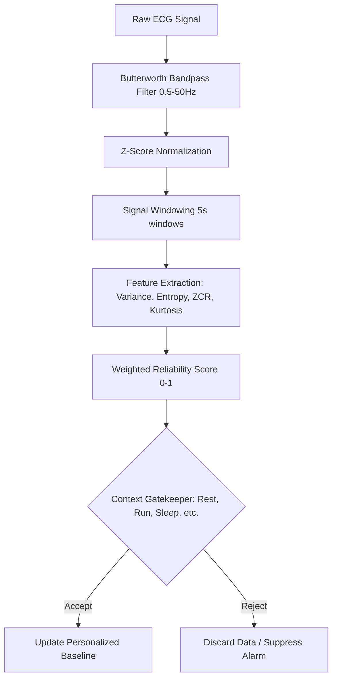

# PhysioTrust: Context-Aware Reliability & Personalized Interpretation

PhysioTrust builds a software-based framework that evaluates the reliability of physiological data and enables safe, personalized health interpretation. It focuses on the question: *"Can this heart rate be trusted right now?"* rather than just calculating it.

---

## 1. Project Inputs

The project runs on raw physiological signal records. In the default configuration, it utilizes the **MIT-BIH Arrhythmia Database** dataset format.

The input files should be located in:
`data/raw/mitbih/`

### Expected Files
For a given subject record (e.g., subject `100`), the following files must be present:
*   **`100.hea` (Header)**: Text file describing record details (leads, sampling frequency $F_s = 360$ Hz, signal gains, etc.).
*   **`100.dat` (Signal)**: Binary file containing the digitized samples of the ECG signal.
*   **`100.atr` (Annotations)**: Binary file containing reference annotations (optional for reliability score itself but part of standard database distribution).

---

## 2. Process & Pipeline (How It Works)

PhysioTrust processes raw input signals through the following stages:



### Key Stages
1.  **Preprocessing (Filtering & Normalization)**:
    *   **Bandpass Filtering**: A Butterworth filter limits the signal to $0.5$ Hz to $50$ Hz, removing baseline wander (low frequency) and muscle noise/powerline interference (high frequency).
    *   **Z-Score Normalization**: Standardizes the signal so that different recording gains are scaled uniformly ($\mu = 0, \sigma = 1$).
2.  **Windowing**: The preprocessed signal is divided into $5.0$-second non-overlapping windows.
3.  **Feature Extraction**: For each window, quality features are computed:
    *   *Variance*: Identifies flatlines/signal loss.
    *   *Signal Entropy*: Measures complexity (structured signals have lower entropy, noisy signals have high entropy).
    *   *SNR Proxy*: Evaluates signal power.
    *   *Zero Crossings*: Identifies high frequency noise.
    *   *Kurtosis*: Evaluates the "peakiness" of the signal (strong QRS complexes yield high kurtosis).
4.  **Reliability Score**: Computes a score between $0.0$ and $1.0$ by combining Entropy, Kurtosis, and Variance scores using weighted sigmoid mappings.
5.  **Context-Aware Gatekeeper**: Validates the reliability score against activity-dependent thresholds:
    *   `Rest` threshold: $0.6$
    *   `Sleep` threshold: $0.7$
    *   `Walking` threshold: $0.4$
    *   `Running` threshold: $0.3$ (Allows noisier signals during high movement).
6.  **Personalization Baseline**: Keeps a running baseline of physiological statistics (e.g., variance) by updating history *only* when the current window is marked "Reliable".

---

## 3. Project Outputs

Running the pipeline populates the `results/` directory with the following outputs:

### 1. Visualizations
*   **Path**: [results/plots/reliability_analysis.png](file:///d:/PhysioTrust/results/plots/reliability_analysis.png)
*   **Contents**:
    *   *Subplot 1*: First 1000 samples comparison of Raw vs. Preprocessed (Filtered and Normalized) signal.
    *   *Subplot 2*: Timeline of computed Reliability Scores per window overlaid with the contextual threshold.
    *   *Subplot 3*: Scatter plot separating Accepted (green circle) vs. Discarded (red cross) signal windows.

### 2. Tabular Reports
*   **Detailed Dataset**: [results/tables/reliability_summary.csv](file:///d:/PhysioTrust/results/tables/reliability_summary.csv)
    *   CSV file containing columns: `Window_Index`, `Reliability_Score`, `Accepted` (True/False), and `Context`.
*   **Baseline Metrics Report**: [results/tables/baseline_metrics.txt](file:///d:/PhysioTrust/results/tables/baseline_metrics.txt)
    *   Summary text file tracking:
        *   Total processed windows.
        *   Acceptance rate (%).
        *   Personalized variance baseline mean.

---

## 4. How to Run

1.  **Create and Activate Environment**:
    ```powershell
    # Create the environment
    C:\Users\motinath_\AppData\Local\Programs\Python\Python312\python.exe -m venv .venv
    
    # Activate in PowerShell
    .venv\Scripts\Activate.ps1
    ```
2.  **Install Dependencies**:
    ```bash
    pip install -r requirements.txt
    ```
3.  **Run the Pipeline**:
    *   You can open Jupyter and execute `main.ipynb` cell-by-cell:
        ```bash
        jupyter notebook
        ```
    *   Or run it directly from command line using nbconvert:
        ```bash
        jupyter nbconvert --to notebook --execute --inplace main.ipynb
        ```

---

## 5. How to Check If Output is Correct

To confirm that the project executed successfully and the model behaves correctly, perform the following validation checks:

### 1. Check the Verification File (`baseline_metrics.txt`)
Open the generated report at `results/tables/baseline_metrics.txt`. It should match these values for the standard MIT-BIH Subject 100 raw recording:
*   **Processed Windows**: `361` (Indicating the full $30$-minute record was correctly segmented into $5.0$-second windows).
*   **Acceptance Rate**: `100.0%` (Subject 100 has a very clean signal in the default simulated `rest` context, meaning no windows fell below the $0.6$ threshold).
*   **Personalized Variance Baseline**: `0.9984` (This represents the learned normal variance baseline of the subject).

### 2. Verify Visualizations (`reliability_analysis.png`)
Open the plot at `results/plots/reliability_analysis.png`. Verify the following features:
*   **Subplot 1 (Preprocessing)**: The raw signal (blue) is centered on $0.0$ and clean/normalized (green), with baseline drift eliminated.
*   **Subplot 2 (Reliability Score)**: The purple line should show computed scores per window (typically values $> 0.8$ for this record) and a red dashed line at $0.6$ indicating the activity threshold.
*   **Subplot 3 (Acceptance Decision)**: Since all windows are accepted, it should contain green dots representing accepted windows, with no red crosses.

### 3. Check Tabular Summary (`reliability_summary.csv`)
Open `results/tables/reliability_summary.csv`. Check that:
*   It has exactly `362` lines (1 header line + 361 data rows).
*   The `Accepted` column contains `True` for all rows.
*   The `Context` column contains `rest` for all rows.
*   `Reliability_Score` column contains float values between $0.0$ and $1.0$.

