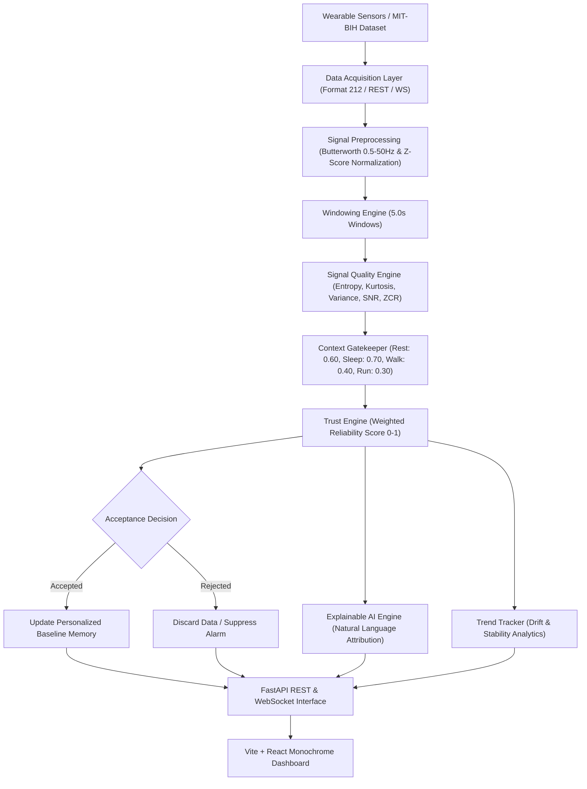

# Task 0.7 — End-to-End System Architecture (`docs/007-ARCHITECTURE.md`)

# PhysioTrust System Architecture & Dataflow Specification

---

## 1. High-Level Architecture Diagram

---

## 2. Component Breakdown

### 1. Ingestion Layer
- Support for offline batch files (`.dat`, `.hea`, `.atr`) via pure NumPy binary parser.
- Support for live streaming via WebSocket chunk packets (18 samples per ~50ms frame at 360 Hz).
- Support for raw array payload uploads via HTTP POST `custom_signal` JSON requests.

### 2. Processing Pipeline
- **Bandpass Filter**: 4th-order Butterworth digital filter ($0.5\text{ Hz} – 50\text{ Hz}$) implemented using `scipy.signal.filtfilt` to guarantee zero phase distortion.
- **Z-Score Normalizer**: Scales signal vectors to zero mean and unit variance.
- **Window Segmentation**: Divides clean signal vectors into fixed 5.0-second array windows ($1800$ samples at $360\text{ Hz}$).

### 3. Intelligence Core
- **Quality Scorer**: Computes sub-scores using sigmoidal non-linear transformations:
  $$\text{Score}_{\text{entropy}} = \frac{1}{1 + H(x)}, \quad \text{Score}_{\text{kurtosis}} = \sigma\left(\frac{K(x) - 3}{2}\right), \quad \text{Score}_{\text{variance}} = \sigma\left(10 \cdot (\text{Var}(x) - 0.1)\right)$$
- **Trust Engine**: Computes weighted score:
  $$\text{Reliability} = 0.40 \cdot \text{Score}_{\text{entropy}} + 0.40 \cdot \text{Score}_{\text{kurtosis}} + 0.20 \cdot \text{Score}_{\text{variance}}$$
- **Context Gatekeeper**: Evaluates \(\text{Reliability} \ge \text{Threshold}_{\text{context}}\).

### 4. API & Application Serving Layer
- **FastAPI Core**: Async ASGI web application serving REST endpoints under `/api/v1` and WebSockets under `/ws`.
- **Static Mounting**: Mounts compiled Vite React assets (`frontend/dist/`) under root `/`.
- **Docker Container**: Single container packaging Python 3.12 runtime, pre-compiled frontend assets, and dataset files.
