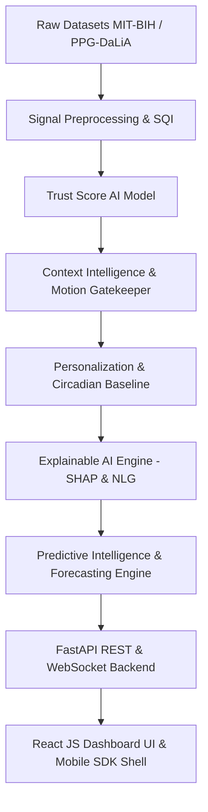

# PhysioTrust Architectural Dependency Diagram

```mermaid
graph TD
    A[Raw Datasets MIT-BIH / PPG-DaLiA] --> B[Signal Preprocessing & SQI]
    B --> C[Trust Score AI Model]
    C --> D[Context Intelligence & Motion Gatekeeper]
    D --> E[Personalization & Circadian Baseline]
    E --> F[Explainable AI Engine - SHAP & NLG]
    F --> G[Predictive Intelligence & Forecasting Engine]
    G --> H[FastAPI REST & WebSocket Backend]
    H --> I[React JS Dashboard UI & Mobile SDK Shell]
```
