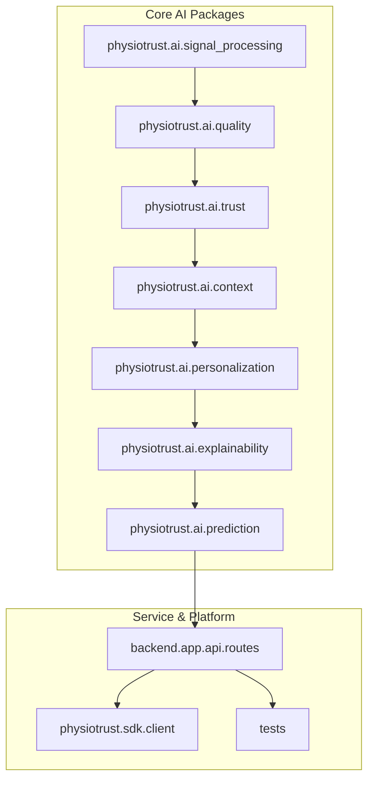

# PhysioTrust Import Graph Specification

```mermaid
graph TD
    subgraph Core AI Packages
        SP[physiotrust.ai.signal_processing]
        Q[physiotrust.ai.quality]
        T[physiotrust.ai.trust]
        C[physiotrust.ai.context]
        P[physiotrust.ai.personalization]
        X[physiotrust.ai.explainability]
        PR[physiotrust.ai.prediction]
    end

    subgraph Service & Platform
        BE[backend.app.api.routes]
        SDK[physiotrust.sdk.client]
        TESTS[tests]
    end

    SP --> Q
    Q --> T
    T --> C
    C --> P
    P --> X
    X --> PR
    PR --> BE
    BE --> SDK
    BE --> TESTS
```
